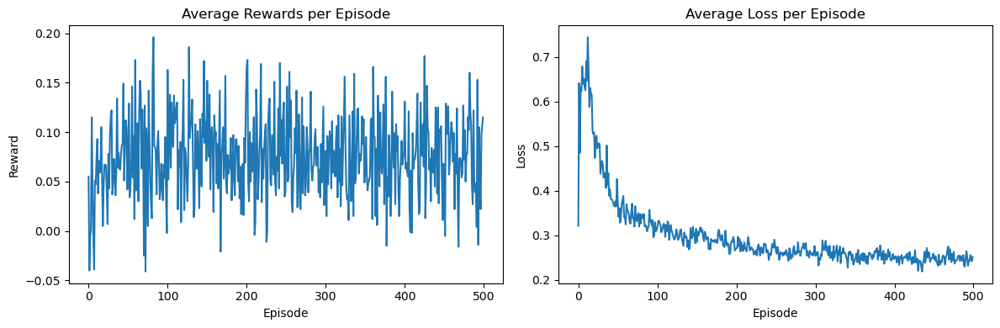

The code implements a simplified environment called `FlowTableEnv` for training an agent to manage a flow table.

### 1. `FlowTableEnv` Class
The `FlowTableEnv` class defines the environment that the agent will interact with. This environment is modeled after the concept of managing a flow table in a network scenario. Below are the key parts of the environment:

#### a. Initialization (`__init__`)
- **`table_size` (default value 10)**: This parameter controls the number of flows that can be managed in the flow table. In this simplified version, the table size is reduced to make the problem more manageable.
- **Attributes**:
  - **`flow_table`**: A list that stores the flows currently in the table.
  - **`new_flow`**: The incoming new flow that needs to be added to the flow table.
  - **`observation_space`**: Defines the size of the state the agent will observe. In this environment, each flow has two attributes (‘priority’ and ‘usage’), resulting in `observation_space = (table_size + 1) * 2`.
  - **`action_space`**: Defines the number of possible actions, which is equal to the `table_size`. The agent can choose which flow entry to replace.

#### b. Reset Method (`reset`)
- **`reset()`** initializes the environment, fills the flow table with random flows, and generates a new flow. It returns the initial state of the environment to the agent.
- **`_generate_flow()`** is a helper function that generates a flow with attributes such as priority, usage, age, and packet count. These attributes are randomly assigned integer values between 1 and 5.
- **`_get_state()`** compiles the current state, which consists of the attributes of each flow in the table along with the new flow. The state is represented as a NumPy array.

#### c. Step Method (`step`)
- **`step(action)`** takes an action, which is an index specifying which flow entry to replace with the new flow.
- If the action is valid (within the flow table), the **`_calculate_reward()`** function is called to evaluate the effect of the action and determine the reward for the agent. The old flow is replaced by the new flow at the specified index.
- If the action is invalid (e.g., greater than or equal to `table_size`), a penalty of ‘-1’ is given as a reward.
- After the action is taken, a new flow is generated for the next step.

#### d. Reward Calculation (`_calculate_reward`)
- **Weights for Reward Components**: The weights for each attribute (‘priority’, ‘usage’, ‘age’, and ‘packet_count’) are defined. The weights reflect the importance of each attribute in the decision-making process.
  - **Higher priority, lower usage, lower age, and lower packet count** are generally preferred when deciding which flow to replace.
- **Reward Calculation**:
  - **`old_flow_value`** and **`new_flow_value`** are calculated by summing up the weighted values for each attribute.
  - **`raw_reward`** is computed as the difference between the values of the new flow and the old flow.
  - **Normalization**: The reward is normalized to be between -5 and 5 to ensure consistent training and prevent extreme values that might destabilize learning.

#### e. Printing the Flow Table (`print_flow_table`)
- **`print_flow_table()`** uses the `tabulate` library to print a table showing the current flow table, including attributes such as ‘priority’ and ‘usage’.
- This method is particularly helpful for debugging and visualizing the current state of the flow table.

### 2. Double Deep Q-Network (DDQN) Agent Implementation
#### Neural Network Architecture
- Input layer: State size
- Hidden layers: 
  - First hidden layer: 64 neurons with ReLU activation
  - Second hidden layer: 32 neurons with ReLU activation
- Output layer: Action size (Q-values for each possible action)

#### Hyperparameters
- Memory buffer size: 10,000 experiences
- Discount factor (gamma): 0.95
- Initial exploration rate (epsilon): 1.0
- Minimum exploration rate: 0.01
- Exploration decay rate: 0.995
- Batch size: 128
- Learning rate: 0.001
- Target network update frequency: Every 10 updates

### Key Methods

#### a. Experience Collection
- `remember()`: Stores experiences (state, action, reward, next_state, done) in replay buffer
- `act()`: Selects actions using epsilon-greedy strategy
  - Explores random actions with probability epsilon
  - Exploits learned policy using the main network otherwise

#### b. Learning Process
- `replay()`: Implements the DDQN learning algorithm
  1. Samples random batch of experiences from memory
  2. Uses main network to select actions for next states
  3. Uses target network to evaluate those actions
  4. Computes target Q-values using the Bellman equation
  5. Updates the main network through backpropagation
  6. Periodically updates the target network

#### c. Training Flow
- `train()`: Combines experience storage and learning
  1. Stores new experience in memory
  2. Triggers a learning step through replay
  3. Returns the loss value from training

### 3. Training with Visualization
The implementation includes a detailed training process with real-time visualization of the agent's performance. The training setup consists of:

#### a. Environment and Agent Setup
- Initializes the `FlowTableEnv` environment
- Creates a DDQN agent with state and action sizes matching the environment
- Training runs for 500 episodes with 50 steps per episode (reduced for demonstration purposes)

#### b. Training Loop Structure
- **Per Episode**:
  - Resets environment and prints initial flow table state
  - Tracks episode-specific rewards and losses
  - Runs 50 steps of interaction
  - Calculates and stores average reward and loss

- **Per Step**:
  - Agent selects action using current policy
  - Environment processes action and returns next state and reward
  - Agent trains on the experience
  - Prints detailed information:
    - Current step number
    - Action taken
    - Updated flow table
    - Immediate reward
    - Training loss

#### c. Performance Visualization
- **Real-time Metrics**:
  - Displays episode summaries including:
    - Average reward
    - Average loss
    - Current exploration rate (epsilon)

- **Final Plotting**:
  - Generates two side-by-side plots:
    1. Average rewards per episode
    2. Average loss per episode
  - Helps visualize the agent's learning progress and convergence

### 4. Training Results Analysis

The training results visualized in output.png demonstrate the agent's learning progress over 500 episodes:

#### a. Average Rewards Plot (Left)
- This result does not match the expected result. The expected result is that the agent will learn to make better decisions and improve the flow table, resulting in higher rewards over time. However, the agent is not learning to make better decisions.

#### b. Average Loss Plot (Right) 
- Loss values start high (~0.5-0.7) in early episodes
- Steady decrease in loss through first 50 episodes
- Stabilizes around 0.2-0.3 in later episodes

#### c. Key Observations
- The inverse relationship between increasing rewards and decreasing loss confirms effective learning
- Initial high variability reflects exploration phase
- Later stability indicates the agent has learned optimal policies
- Final performance shows the agent can consistently make beneficial flow table management decisions

