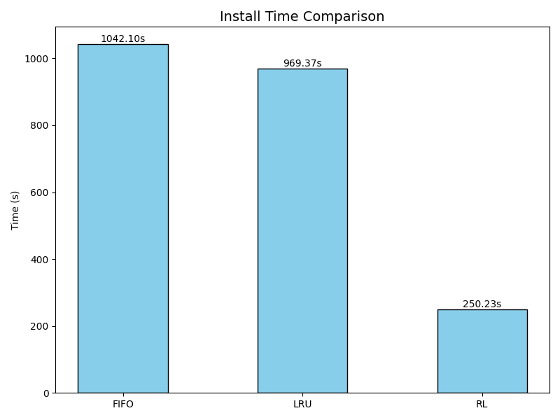
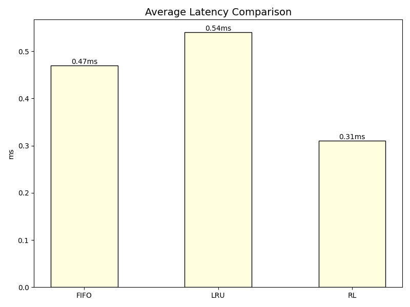
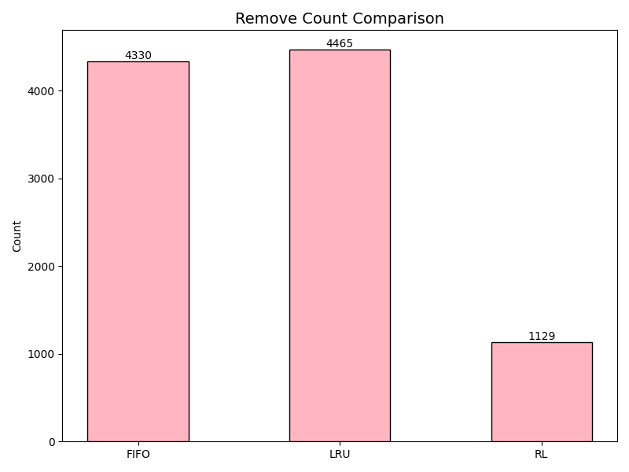

# Flow Table Management in SDN Using Reinforcement Learning

This project leverages Deep Reinforcement Learning to optimize flow table management in Software-Defined Networks (SDN). Our solution addresses the critical challenge of efficiently utilizing limited Ternary Content Addressable Memory (TCAM) space in SDN switches.

## Problem Statement

Modern SDN switches rely on TCAM-based flow tables for packet forwarding decisions. However, TCAM's high cost and power consumption necessitate careful management of limited space. Traditional flow eviction policies like FIFO and LRU often lead to suboptimal decisions, resulting in increased controller overhead and degraded network performance.

## Our Approach

We developed an intelligent flow management system using a Double Deep Q-Network (DDQN) that learns optimal eviction policies by considering multiple flow characteristics:

- Flow priority levels
- Timeout values
- Packet statistics
- Byte usage patterns

## Core Features

- **Custom Environment**: Built on OpenAI Gym for realistic SDN simulation
- **Advanced RL Architecture**: 
  - Double DQN with dual hidden layers (64 neurons each)
  - Prioritized experience replay buffer
  - Adaptive learning rate
- **Production-Ready Testing**: Mininet-based evaluation with realistic network loads

## Performance Results

Our RL-based solution significantly outperforms traditional approaches:

| Metric | Improvement |
|--------|-------------|
| Flow Installation Time | 75% faster |
| Unnecessary Evictions | 74% reduction |
| Packet Latency | 40% decrease |
| Controller Load | Substantial reduction |
| Traffic Adaptation | Enhanced flexibility |

### Visual Performance Analysis

#### Installation Time


#### Network Latency


#### Eviction Efficiency  


## Project Structure

- `generate_data.py`: Creates synthetic network traffic patterns
- `test_topology.py`: Defines Mininet network topology for testing
- Controller implementations:
  - FIFO: Queue-based eviction strategy
  - LRU: Timestamp-based eviction
  - RL Controller: DDQN-based decision making

## Prerequisites

- Python 3.6+
- Mininet
- Ryu SDN Controller
- TensorFlow/PyTorch
- OpenAI Gym

## Usage

1. Generate traffic data:
```
python generate_data.py
```

2. Set up the Mininet topology:
```
sudo python test_topology.py
```

3. Run the desired controller (RL, FIFO, or LRU)
```
ryu-manager [controller_file].py
```